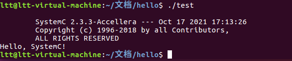
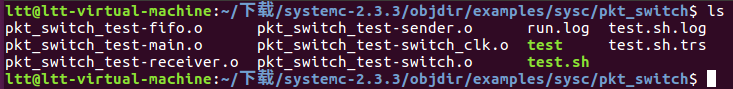
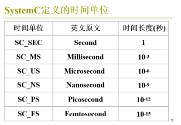

# <FONT style=" FILTER: shadow(color=#af2dco); WIDTH: 100%; LINE-HEIGHT: 100%; FONT-FAMILY: 宋体" >SystemC入门指南</font>

  为方便实验室同学短时间入门SystemC ,李甜甜、姜国勇、吴卓栋同学根据学习经验，总结SystemC学习的相关内容，包括SystemC的安装、运行、入门基础知识、以及参考资料，供实验室同学学习参考。

## <FONT style=" FILTER: shadow(color=#af2dco); WIDTH: 100%; LINE-HEIGHT: 100%; FONT-FAMILY: 宋体" >一、SystemC介绍</font>

​		SystemC继承和扩展于C++，可以建模不同抽象级别的包括软件和硬件的复杂电子电路。既可以描述纯功能模型和系统体系结构，也可以描述软硬件的具体实现。主要应用于电子系统级设计、建模和验证。			

​		SystemC具有所有硬件描述语言所共有的基本特征，包括模块、进程、端口和信号等。在SystemC中，时钟被单独定义为一个特殊的信号，这大大简化了时钟信号的定义和使用。为了支持进程同步和通信细化，SystemC支持用户自定义的接口(Interface)、端口(Port)和通道(Channel)。其中，端口负责模块之间的连接，定义了它能够具体连接的接口类型，只能被用于连接实现了这类接口的通道。

  总的来说，SystemC的主要特性包括：

- 模块(Modules)：这是一个容器类，一个分层结构的实体，可以包含其他的模块或进程(processes)。
- 进程(Processes)：进程用于各个具体功能的实现，它必须包含于某个模块里，SystemC可以有三种不同类型的进程：SC\_METHOD, SC\_THREAD, SC\_CTHREAD。更多详细内容将在以后介绍。
- 端口(Ports)：模块提供对外的端口，用于模块之间的连接。
- 信号(Signals)：SystemC提供两种信号: Resolved and unresolved signals. Resolved信号可以连接总线，而Unresolved信号只能连接一个总线。
- 数据类型(Data types)
- 时钟(Clocks)：SystemC有时钟的概念(一种特殊的信号(Signal))，时钟是系统的时间保持器，为系统仿真提供基本的时间信号。
- 多层级的抽象，从上层的功能仿真到底层精确到时钟周期的模型仿真。

​    SystemC核心库和数据类型库定义了SystemC支持硬件描述的基本语法和命名空间。在此之上。SystemC定义了基本通道类型以支持更加复杂的仿真。在前二者之上。SystemC目前还定义了验证库、事务处理级建模库、模拟和混合信号建模库。		

## <FONT style=" FILTER: shadow(color=#af2dco); WIDTH: 100%; LINE-HEIGHT: 100%; FONT-FAMILY: 宋体" >二、SystemC安装及测试程序编译</font>

​	此安装过程是将SystemC-2.3.3安装于Ubuntu 16.04系统下为例。

***

### <font style=" FILTER: shadow(color=#af2dco); WIDTH: 100%; LINE-HEIGHT: 100%; FONT-FAMILY: 宋体" >1.1、SystemC安装过程</font> 

**1、将SystemC-2.3.3压缩包解压缩后，进入最上层目录（SystemC-2.3.3）**


**2、创建临时目录objdir，并进入该目录**

	mkdir objdir
	cd objdir

**3、为您的系统配置包**

	../configure

如果你想把包安装到其他地方，配置包，例如:

	../configure --prefix=/usr/local/systemc-2.3.3

（本例是这样的，把systemc文件复制到/usr/local/systemc-2.3.3/文件夹下）

**4、编译及安装软件包**

	make
	sudo make install

**5、配置环境**

	sudo gedit ~/.bashrc
	
	在最下面添加
	export LD_LIBRARY_PATH=/usr/local/systemc-2.3.3/lib-linux64:$LD_LIBRARY_PATH
	保存退出
	
	source ~/.bashrc

**6、安装过程结束，您可以选择删除临时目录**

	cd .. 
	rm -rf objdir

您可以选择保留临时目录，以实现以下功能

- 运行SystemC自带例子（将在 1.3 部分介绍）
- 清除临时目录  `make clean`
- 卸载软件包   `make uninstall`
***

### <font style=" FILTER: shadow(color=#af2dco); WIDTH: 100%; LINE-HEIGHT: 100%; FONT-FAMILY: 宋体" >1.2、测试文件的编译</font> 

#### 	<font style=" FILTER: shadow(color=#af2dco); WIDTH: 100%; LINE-HEIGHT: 100%; FONT-FAMILY: Times New Roman" >1.2.1、测试文件的编写</font> 


	//hello.h
	#ifndef _HELLO_H
	#define _HELLO_H
	#include "systemc.h"
	SC_MODULE(hello){
		SC_CTOR(hello){
		cout<<"Hello, SystemC!"<<endl;
		}	
	};
	#endif
	
	//main.cpp
	#include "systemc.h"
	#include "hello.h"
	int sc_main(int i, char* a[]){
	hello h("hello");
	return 0;
	}
#### 	<font style=" FILTER: shadow(color=#af2dco); WIDTH: 100%; LINE-HEIGHT: 100%; FONT-FAMILY: Times New Roman" >1.2.2、利用g++编译测试文件</font>

	g++ main.cpp -I /usr/local/systemc-2.3.3/include/ -L /usr/local/systemc-2.3.3/lib-linux64 -o test -lsystemc
	/*解释：
	-I/usr/local/systemc-2.3.3/include/  g++编译器去/usr/local/systemc-2.3.3/include/下，找所需的systemc.h文件
	-L/usr/local/systemc-2.3.3/lib-linux64  ld连接器去/usr/local/systemc-2.3.3/lib-linux64下去寻找所需的库文件
	-o test  标准的输出参数，生成的可执行文件名为test
	-lsystemc  ld连接器最终的库文件是libsystemc.a*/

执行过后，所在文件夹内会生成一个名为`test`的可执行文件，执行该程序：

	./test
运行结果：



#### 	<font style=" FILTER: shadow(color=#af2dco); WIDTH: 100%; LINE-HEIGHT: 100%; FONT-FAMILY: Times New Roman" >1.2.3、利用`Makefile`编译测试文件</font>

利用`Makefile`编译文件十分方便，下面给出一个通用的`Makefile`写法，使用时只需要将该`Makefile`和需要编译的代码放置于同一目录下，然后在终端中`make`即可得到可执行文件。

	//Makefile
	cc = g++
	prom = test
	deps = $(shell find ./ -name "*.h")
	src = $(shell find ./ -name "*.cpp")
	obj = $(src:%.c=%.o) 
	 
	$(prom): $(obj)
		$(cc) -I /usr/local/systemc-2.3.3/include/ -L /usr/local/systemc-2.3.3/lib-linux64 -o $(prom) $(obj) -lsystemc
	 
	%.o: %.c $(deps)
		$(cc) -c $< -o $@
	 
	clean:
		rm -rf $(obj) $(prom)

### <font style=" FILTER: shadow(color=#af2dco); WIDTH: 100%; LINE-HEIGHT: 100%; FONT-FAMILY: 宋体" >1.3、SystemC自带例子的编译</font>
	cd objdir //进入2.1中创建的临时目录
	cd examples
	cd sysc
	//此时可以打开sysc下任意一个文件夹，里面是空的
	make
	make check
	//此时再进入任意文件夹，里面出现了目标代码，可执行文件等内容，例如：
	cd pkt_switch
	ls


	./test
此时便可以运行SystemC自带例子。

## <FONT style=" FILTER: shadow(color=#af2dco); WIDTH: 100%; LINE-HEIGHT: 100%; FONT-FAMILY: 宋体" >三、SystemC入门知识</font>

### <font style=" FILTER: shadow(color=#af2dco); WIDTH: 100%; LINE-HEIGHT: 100%; FONT-FAMILY: 宋体" >3.1、模块</font> 

​		模块是一个设计最基本的单位，是完成一个特定功能的基本单位。一个模块可以包含一些其他的SystemC基本元素如端口、内部信号、内部数据、子模块、进程、构造函数和析构函数等，这些元素共同定义了模块所能表达的功能。设计者可以定义内部变量来保存模块内部的数据。另外，在模块中可以实例化进程以及其他模块。一个模块只可以通过端口来访问另一个模块，模块外部无法获得模块内部存储的数据。

#### 	<font style=" FILTER: shadow(color=#af2dco); WIDTH: 100%; LINE-HEIGHT: 100%; FONT-FAMILY: Times New Roman" >3.1.1、模块的定义</font>

   在SystemC中常用关键字`SC_MODULE`来声明一个模块。

例如：

```c
SC_MODULE(host)
{.....//Details of the design
};
```
​    以上代码定义了一个名为`host`的模块。 `SC_MODULE`是SystemC库中定义的一个宏，它定义一个模块实际上是定义了一个新的C++结构体，在关键字`SC_MODULE`后面的标志符是模块的名字，即上例中的“host”。另外，还可用C++ struct或者class采用继承的方式定义一个模块，如下所示：	

```c
struct host:public sc_module{.....//Details of the design};
class host:public sc_module{.....//Details of the design};
```

​     模块需要继承父类`sc_module(n)`，其中，参数n类型为`sc_module_name`。可理解为一个常量字符串。这实际是一个类，作为模块名的包容器，并负责建立一个设计中所有例化的模块的层次关系。

#### 	<font style=" FILTER: shadow(color=#af2dco); WIDTH: 100%; LINE-HEIGHT: 100%; FONT-FAMILY: Times New Roman" >3.1.2、模块的构造函数与析构函数</font>

   模块的构造函数完成创建和初始化一个模块的工作，它在一个模块的实例被创建时就被执行。在SystemC中，除了完成C++中要求的基本功能外，构造函数还用于初始化进程的类型并创建进程的敏感表，例如：

```c
SC_CTOR(host)
{
  SC_METHOD(ReceiverEntry);     
  sensitive << clk_pos();
 };  
```
​    在声明或定义模块的构造函数时，SystemC提供了一个宏`SC_CTOR`，其中参数为模块的名称。在构造函数需要对初始化的数据进行初始化，同时初始化进程的敏感表。例如在本例中，进程`ReceiverEntry`对时钟信号的上升沿敏感，在每一个时钟上升沿，`void ReceiverEntry`被执行一次。

​     注意使用宏`SC_CTOR`时无法向构造函数添加用户定义的参数，如果应用程序需要传递额外的参数，则必须显式提供构造函数。SystemC v2.0提供宏定义`SC_HAS_PROCESS`，当模块实例化需要其他参数时，可以使用`SC_HAS_PROCESS`来声明构造函数。  

​    SystemC没有专门的宏来处理析构函数，析构函数还是按照传统的C++模式来声明，仍然使用模块加“~”来标识，主要作用为清除构造函数申请的内存单元。


***

### <font style=" FILTER: shadow(color=#af2dco); WIDTH: 100%; LINE-HEIGHT: 100%; FONT-FAMILY: 宋体" >3.2、端口和信号</font> 

   在SystemC中，模块通过端口（Port）与其他模块通信。端口也分为输入（Input）、输出（Output）和双向端口（Inout）。一个模块的端口可以通过信号（Signal）与其他模块端口相连，或与子/父模块端口直接相连。端口与信号的连接，端口与端口的直接连接在SystemC中称作绑定。  

  端口的数据类型可以是常见C++类型，也可以是SystemC专用数据类型，也可以是用户自定义的结构体。

#### 	3.2.1 端口

**定义方法**

- 输入端口：`sc_in<端口数据类型>端口名`
- 输出端口：`sc_out<端口数据类型>端口名`
- 双向端口：`sc_inout<端口数据类型>端口名`
- 特殊情况：输入时钟信号` sc_in_clk 时钟名字`

举例如下：

```c
sc_in_clk clk；
sc_in<bool> wr_en;
sc_in<sc_uint<8> > addr;
sc_out<sc_uint<8> > rd_data;
```

#### 	<font style=" FILTER: shadow(color=#af2dco); WIDTH: 100%; LINE-HEIGHT: 100%; FONT-FAMILY: Times New Roman" >3.2.2 信号</font>

  sc_signal<T\>是最基本的通道，它用于连接模块的基本端口sc\_in<T\>、sc\_out<T\>、sc\_inout<T\>。
**常用成员函数**      

- `write()`: 如果新值与当前值不同，write()方法将提交一个更新请求。  
- `read()`: 获取当前值。  
- `event()`: 检测当前值是否有变化。  
- `value_changed_event()`： 获取当前值改变这个事件。

SystemC其余基本通道类型：  

1、sc\_buffer<T\>：继承于sc\_signal，它的write()要写的数据不管是否与原数据相同，都要求进行数据更新。这是sc\_buffer与sc\_signal唯一的区别。  

2、sc\_mutex：用来保护共享资源，以避免多个进程同时读写共享资源，导致系统行为不确定。互斥具有锁定和非锁定两种状态。如果有进程需要使用由互斥保护的资源，若互斥未被锁定，则该进程可以将互斥锁定；若互斥被其他进程锁定，这时申请互斥的进程就被阻塞，知道锁定互斥的进程将互斥解锁。  

3、sc\_buffer<T\>：是SystemC库中已经实现好的FIFO通道，其中T为FIFO中存储的数据类型。FIFO中文名称为先进先出队列，write(&T)写FIFO方法；read()读FIFO方法，返回队头单元数据；Num\_free()用于查询FIFO还有多少空单元；num\_available()用于查询FIFO还有多少数据可以读。  

4、sc\_event：可以用来定义一个事件，可以在SC\_THREAD中将进程挂起等待事件发生后重新将进程激活。当事件发生时，通过notify（...）函数来通知所有等待该事件的进程。  

5、sc\_event\_queue：与sc\_event的共同点是都有notify（...）方法。不同点是sc\_event\_queue实际是一个分层通道，它可以有多个等待触发的通知，这些通知不相互覆盖。

#### 3.2.3 时钟信号 

   在SystemC中，时钟信号被作为一个特殊的对象处理。为方便用户使用，SystemC为用户提供时钟`sc_clock`类。  

	sc_clock(const char* name_ ,                     //时钟名字
			 double period_v_ ,                      //时钟周期
			 sc_time_uint period_tu_ ,               //时钟的时间单位，默认为ns   
			 double duty_cycle_ ,                    //占空比，默认为0.5
			 double start_time_v_ ,                  //时钟初始第一逻辑值的持续时间
	         sc_time_uint start_time_tu_ ,           //第一逻辑值的持续时间的时间单位，默认为ns
			 double posedge_first_ = true            //第一个逻辑值是高电平还是低电平 默认为高电平
	 )
	
	//时钟定义举例
	sc_clock clk1("clk1",20,0.5,5,true);
	sc_clock clk2("clk2",20,SC_NS,0.5,5,SC_NS,true);  //其实定义的时钟是一样的，只是clk2里的参数没有省略

​                                 

​    在systemC中，`sc_time`是模拟内核用来跟踪模拟时间的数据类型。若想获得当前仿真时间，可使用`sc\_time\_stamp()`函数。即：

	sc_time current_time=sc_time_stamp();

#### 	<font style=" FILTER: shadow(color=#af2dco); WIDTH: 100%; LINE-HEIGHT: 100%; FONT-FAMILY: Times New Roman" >3.2.4 端口与信号的绑定</font>方式

   端口与信号的连接，以及端口与端口的直接连接都叫做绑定。绑定方法分两种：位置绑定和名字关联。          

- 位置关联：所有的端口都是按照声明的顺序位置进行一一对应的。即关联表中第一个信号对应第一个接口，第二个信号对应第二个接口。 
- 名字关联：让端口和信号的名字一一对应起来，例如：`pwb_slave_if->wr_en(sram_wr_en)`就是将`pwb_slave_if`所指向的模块的端口`wr_en`与信号`sram_wr_en`绑定起来。这种方法可以任意顺序地创建信号与端口的连接而不会产生错误。

### 3.4、进程（Process）

   在SystemC中，进程是一个基本执行单位，它被调用来仿真目标系统的行为。有些进程的行为像函数一样，调用后立刻返回，有些进程在仿真开始后只运行一次一直到仿真结束，有些进程在运行过程中可以被挂起直到某个条件满足。进程通常会有一个敏感表，当敏感表中的信号上有事件发生时，进程就会被激活。  

   进程的特点总结如下：

- 每一个进程用于描述同步逻辑或者组合逻辑
- 模块中进程是并发的。仅在其敏感表的信号发生变化时执行
- 进程不是层次化的，一个进程不能包含或直接调用其他进程，
- 进程可以调用非进程的函数和方法
- 进程在构造函数中登记，表示识别为进程而不是普通成员函数

​    SystemC基本进程有三种`SC_METHOD 方法进程` 、`SC_THREAD 线程进程`、  `SC_CTHREAD 钟控线程进程`。以下进行详细介绍。

#### 	<font style=" FILTER: shadow(color=#af2dco); WIDTH: 100%; LINE-HEIGHT: 100%; FONT-FAMILY: Times New Roman" >3.4.1、SC\_METHOD(func) 方法进程</font>

   在SystemC中，方法进程的特点是当敏感表上有事件发生时，进程就会被调用，调用后立刻返回。只有该类进程返回后仿真系统的事件才有可能前进，因此该类进程中不能使用`wait()`这样的语句。如果该类进程内部有一个死循环，仿真时间将会停止。方法进程的敏感表在模块的构造函数内设定，例如：  

	{...
	 SC_METHOD（main）;
	 sensitive<<clk.pos();        //在每一个时钟clk的上升沿，main被执行一次
	 ...
	}
#### 	<font style=" FILTER: shadow(color=#af2dco); WIDTH: 100%; LINE-HEIGHT: 100%; FONT-FAMILY: Times New Roman" >3.4.2、SC\_THREAD(func) 线程进程 </font>
   线程进程能够被挂起和重新激活，使用`wait()`挂起，当敏感表内有事件发生时，线程进程被重新激活运行到新的wait()语句再被重新挂起。在一次仿真中，线程进程一旦退出，将不能在进入。由于线程进程的这个特点，它有一个方便的用途就是用来描述验证平台的输入激励和输出获取。
#### 	<font style=" FILTER: shadow(color=#af2dco); WIDTH: 100%; LINE-HEIGHT: 100%; FONT-FAMILY: Times New Roman" >3.4.3、SC\_CTHREAD(func, event) 钟控线程进程 </font>
   钟控线程进程是一种特殊的线程进程，它继承于线程进程，但只能在时钟的上升沿或者下降沿被触发或者激活，这种行为更加接近实际硬件的行为。为了仿真硬件行为，钟控线程进程被约束为只能采用`wait()`和`wait(int n)`两种等待形式，其中n是等待的时钟周期数。

**关于以上三种进程总结**：  

- SC\_THREAD可以完成SC\_METHOD或SC\_CHTEAD的所有功能。  

- 为了再次调用SC\_THREAD或SC\_CTHREAD进程，应该有一个while循环来确保它永远不会退出。  

- next\_trigger()只能用于SC\_METHOD进程，参数与wait()相同。next\_trigger()特点是调用后立刻返回，在一个SC\_METHOD进程中可以多次调用next\_trigger()，但由最后一个next\_trigger()决定进程下一次的激活时间。SC\_METHOD进程不能挂起，next\_trigger()只是为该进程增加了一个动态敏感事件而已。

**注：sensitive和dont\_initialize()** 

1. sensitive为SC\_METHOD进程和SC\_CTHREAD进程设置敏感表，基本格式为：  
  
		进程类型（进程名）；  
		sensitive<<敏感信号<<敏感信号n;  
		//这部分代码必须放在模块的构造函数内部

2. 在默认情况下，所有进程在仿真开始0时刻被执行一次或者开始被执行。若希望进程在仿真的0时刻不被执行，此时可以使用dont\_initialize()，只有在其后敏感表内事件发生时进程才开始执行。

### <font style=" FILTER: shadow(color=#af2dco); WIDTH: 100%; LINE-HEIGHT: 100%; FONT-FAMILY: 宋体" >3.5、仿真</font>

#### 	<font style=" FILTER: shadow(color=#af2dco); WIDTH: 100%; LINE-HEIGHT: 100%; FONT-FAMILY: Times New Roman" >3.5.1、SystemC设计的顶层函数sc\_main </font>

  SystemC本质上是C++，因此使用大多数C++编译器都能编译和链接SystemC设计为可执行文件，此时必须设计SystemC的顶层函数sc\_main。在此顶层函数中，将设计中的所有模块连接在一起，并且引入时钟和波形跟踪等。sc\_main函数的格式如下：

	int sc_main(int argc,char* argv[]){...//body}
	//其中第一个参数表示参数的数目，第二个参数是用字符串表示的参数的值

#### 	<font style=" FILTER: shadow(color=#af2dco); WIDTH: 100%; LINE-HEIGHT: 100%; FONT-FAMILY: Times New Roman" >3.5.2、仿真控制</font>

**1、sc\_start()**  

  ` sc_start()`函数一旦被调用，仿真就开始了。`sc_start()`函数控制所有时钟的产生并在适当的时机激活SystemC调度器，控制整个仿真过程中的调度工作，包括激活进程、计算和更新变量和信号的值等。一般来说，`sc_start()`只在sc\_main()中调用，sc\_start()函数格式为：

- sc\_start()没有参数，表示仿真一直进行知道遇到sc\_stop()函数，该函数控制仿真的停止。  


- void sc\_start(const sc\_time& duration)的参数duration是sc\_time类型。若duration为任意正数，仿真将持续duration个时间单位，若duration为负数，仿真将持续进行直到遇见sc\_stop()函数。  


- void sc\_start(double t, sc\_time\_uint tu)表示仿真进行t个tu时间单位或者遇到sc\_stop()函数停止

  仿真中经常需要直到当前的仿真时间以分析仿真结果是否与预期结果相符，sc\_simulation\_time()返回当前仿真的时间值。

**2、sc\_stop()**

sc\_stop()函数停止仿真并将控制权交给sc\_main()。

## <FONT style=" FILTER: shadow(color=#af2dco); WIDTH: 100%; LINE-HEIGHT: 100%; FONT-FAMILY: 宋体" >四、SystemC学习资源</font>

1、https://learnsystemc.com/  

2、SystemC自带例子的研习：https://blog.csdn.net/chenleiyfk/article/details/117555134     

3、SystemC学习，从安装环境到基本语法到行为级事务级建模等都有介绍： https://blog.csdn.net/tristan_tian/article/details/109555823

4 、http://homes.di.unimi.it/~pedersini/AD/SystemC_v201_LRM.pdf

5、https://www.accellera.org/downloads/standards/systemc

6、https://systemc.org/

